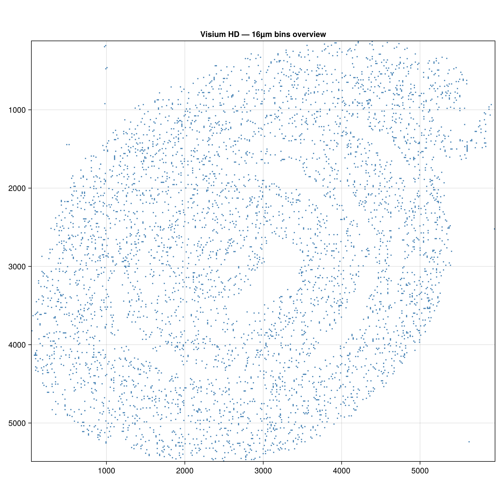
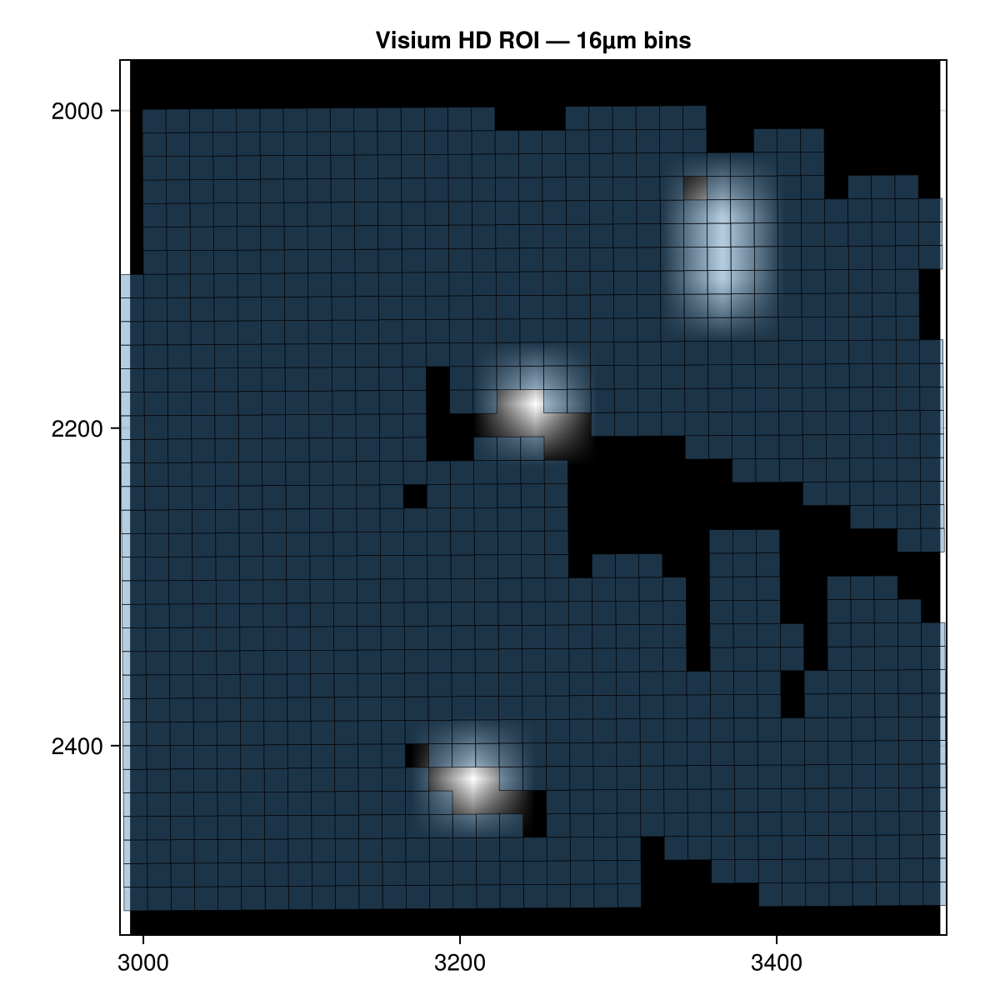

# Visium HD spatial transcriptomics

!!! note "Pre-rendered tutorial"
    This tutorial uses a full Visium HD dataset (~2.4 GB). The code is **not run
    automatically** — images below are pre-rendered and committed to the
    repository. To reproduce them locally, download the dataset and run
    `test/make_fixtures.jl` as described in the [Creating a subset](#creating-a-subset) section.

## About the dataset

The example dataset is the **10x Genomics Visium HD Mouse Small Intestine**,
distributed by the [SpatialData project](https://spatialdata.scverse.org/en/stable/tutorials/notebooks/datasets/)
as a Python-compatible OME-Zarr store. It contains:

- Square bin shapes at three resolutions: 2 µm, 8 µm, and 16 µm
- Four registered images: CytAssist scan, full-resolution H&E, high-resolution, and low-resolution
- Expression tables (one per bin resolution; AnnData format — not currently read by SpatialOmics)

Visium HD is a **spot-based** assay: rather than single-molecule transcripts,
expression is aggregated into spatial bins (squares). The bin size controls the
spatial resolution versus signal-to-noise trade-off — 2 µm bins are high
resolution but sparse; 16 µm bins are noisier but better covered.

## Download

Download the Visium HD example store from the SpatialData datasets page. Place
the `visium_ex.zarr` directory at a convenient path:

```julia
visium_path = "/path/to/visium_ex.zarr"
```

## Load and inspect

```julia
using SpatialOmics

vis = read(SpatialDataZarr(), visium_path)

keys(elements(vis))
coord_systems(vis)
```

The three bin-resolution shape layers share the same coordinate system but
have very different element counts:

```julia
for name in ("Visium_HD_Mouse_Small_Intestine_square_002um",
             "Visium_HD_Mouse_Small_Intestine_square_008um",
             "Visium_HD_Mouse_Small_Intestine_square_016um")
    shp = shapes(vis, name)
    @info name length(geometries(shp))
end
```

## Visualise

```julia
using CairoMakie

# 16µm bins give a readable overview without millions of polygons
shp = shapes(vis, "Visium_HD_Mouse_Small_Intestine_square_016um")
n   = length(geometries(shp))
idx = n > 5_000 ? rand(1:n, 5_000) : 1:n   # subsample for the overview

fig = Figure(size=(900, 900))
ax  = Axis(fig[1, 1]; aspect=DataAspect(), yreversed=true,
           title="Visium HD — 16µm bins (subsampled)")
poly!(ax, SpatialShapes(geometries(shp)[idx]; instance_id=instance_id(shp)[idx],
                        coord_system=shp.coord_system);
     color=:steelblue, strokewidth=0)
tightlimits!(ax)
fig
```



## Explore a region

```julia
ext = SpatialExtent(2000.0, 2500.0, 1500.0, 2000.0; coord_system="global")
roi = view(vis, ext)

fig = Figure(size=(700, 700))
ax  = Axis(fig[1, 1]; aspect=DataAspect(), yreversed=true,
           xlabel="x (µm)", ylabel="y (µm)")
image!(ax,   scaleminmax(channel(images(roi, "Visium_HD_Mouse_Small_Intestine_lowres_image"), 1)))
poly!(ax, shapes(roi, "Visium_HD_Mouse_Small_Intestine_square_016um");
     color=(:steelblue, 0.35), strokewidth=0.3)
tightlimits!(ax)
fig
```



## Creating a subset

The fixture at `test/data/visium_small.zarr` covers a patch of the small
intestine at 16 µm bin resolution. Generate it with `test/make_fixtures.jl`
(two-pass, same workflow as the Xenium tutorial):

```julia
# Inspect visium_overview.png to pick a region, then fill in coordinates:
ext = SpatialExtent(VIS_XMIN, VIS_XMAX, VIS_YMIN, VIS_YMAX; coord_system="global")
roi = view(vis, ext)

sub = SpatialDataset()
sub["Visium_HD_Mouse_Small_Intestine_square_016um"] =
    collect(shapes(roi, "Visium_HD_Mouse_Small_Intestine_square_016um"))
sub["Visium_HD_Mouse_Small_Intestine_lowres_image"] =
    images(roi, "Visium_HD_Mouse_Small_Intestine_lowres_image")

save!(sub; path="test/data/visium_small.zarr")
```

## Working with the committed fixture

```julia
ds = read(SpatialDataZarr(), joinpath(pkgdir(SpatialOmics), "test", "data", "visium_small.zarr"))

shp = shapes(ds, "Visium_HD_Mouse_Small_Intestine_square_016um")
img = images(ds, "Visium_HD_Mouse_Small_Intestine_lowres_image")

@show length(geometries(shp))
@show size(data(img))
```
