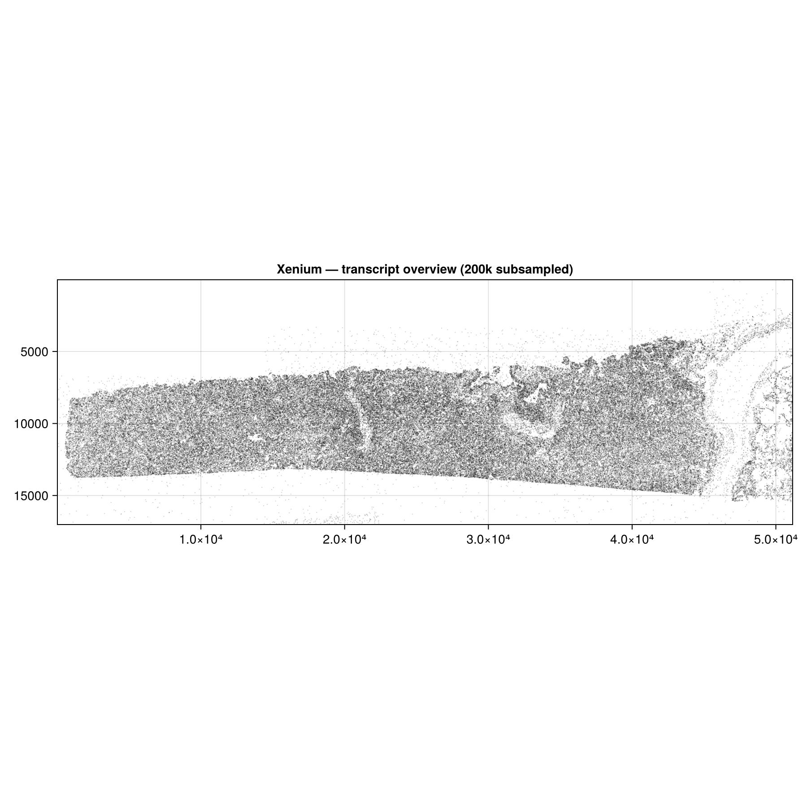
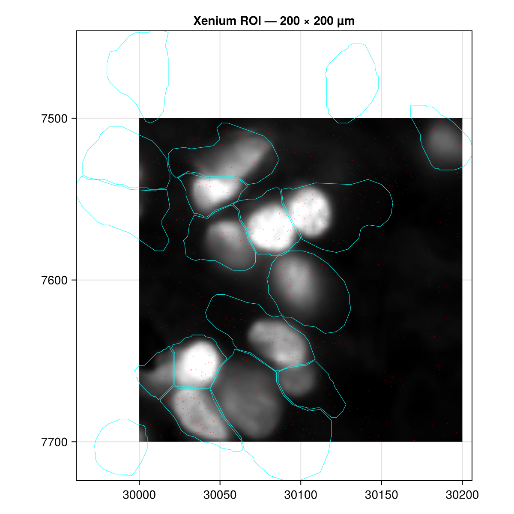

# Xenium spatial transcriptomics

!!! note "Pre-rendered tutorial"
    This tutorial uses a full Xenium dataset (~5 GB). The code is **not run
    automatically** — images below are pre-rendered and committed to the
    repository. To reproduce them locally, download the Xenium and Visium
    datasets and run
    `test/make_fixtures.jl` as described in the [Creating a subset](#creating-a-subset) section.

## About the dataset

The example dataset is the [**10x Genomics Xenium FFPE Human Lung Cancer with
multimodal cell segmentation**](https://www.10xgenomics.com/datasets/preview-data-ffpe-human-lung-cancer-with-xenium-multimodal-cell-segmentation-1-standard),
distributed in a converted form by the [SpatialData project](https://spatialdata.scverse.org/en/stable/tutorials/notebooks/datasets/)
as a Python-compatible OME-Zarr store. It contains:

- ~5 million transcripts (`points/transcripts`)
- Cell boundary polygons (`shapes/cell_boundaries`) and nucleus boundaries
- 4-channel fluorescence tissue image (`images/morphology_focus`)
- H&E image (`images/he_image`)
- Cell segmentation label mask (`labels/cell_labels`)

## Download

Download the Xenium example store from the SpatialData datasets page. The store
is a directory named `xenium_ex.zarr`; place it wherever is convenient (the
path below is arbitrary):

```julia
# Adjust path to wherever you downloaded the store
xenium_path = "/path/to/xenium_ex.zarr"
```

## Load and inspect

```julia
using SpatialOmics

xen = read(SpatialDataZarr(), xenium_path)

# Element inventory
keys(elements(xen))

# Coordinate systems
coord_systems(xen)

# Top 20 expressed genes
tx = points(xen, "transcripts")
top_features(tx, 20)

# Cells with transcript counts
counts = count_per_instance(tx)
sort(collect(values(counts)); rev=true)[1:10]   # top 10 cells by count
```

## Visualise

A subsampled scatter over the full slide gives a quick overview of tissue
layout and transcript distribution.

```julia
using CairoMakie

fig = Figure(size=(900, 900))
ax  = Axis(fig[1, 1]; aspect=DataAspect(), yreversed=true,
           title="Xenium — transcript overview")

n   = length(coords(tx))
idx = sort(rand(1:n, 200_000))   # subsample for speed
scatter!(ax, coords(tx)[idx]; markersize=0.3, color=(:black, 0.08))
tightlimits!(ax)
fig
```



## Explore a region of interest

Define a spatial extent and build a lazy view. Each plot verb applies the
filter independently — no intermediate copies are made.

```julia
ext = SpatialExtent(3500.0, 3700.0, 2800.0, 3000.0; coord_system="global")
roi = view(xen, ext)

fig = Figure(size=(600, 600))
ax  = Axis(fig[1, 1]; aspect=DataAspect(), yreversed=true,
           xlabel="x (µm)", ylabel="y (µm)")

image!(ax,   scaleminmax(channel(images(roi, "morphology_focus"), 1)))
poly!(ax,    shapes(roi, "cell_boundaries");  color=:transparent,
                                              strokecolor=:cyan, strokewidth=0.5)
scatter!(ax, points(roi, "transcripts");      markersize=1.5, color=(:red, 0.4))
tightlimits!(ax)
fig
```



## Creating a subset

The committed test fixture at `test/data/xenium_small.zarr` was created from a
200 µm × 200 µm region of this dataset. The `test/make_fixtures.jl` script
writes overview figures, native fixtures, and ROI figures.

Run it once, inspect the overview figures, and update the region constants in
the script if a different patch is needed:

```julia
# Run from the repository root:
# julia --project=docs/heavy -e 'using Pkg; Pkg.instantiate()' # first use
# julia --project=docs/heavy test/make_fixtures.jl /path/to/xenium_ex.zarr /path/to/visium_ex.zarr
# Inspect docs/src/assets/xenium_overview.png, then update
# XEN_XMIN / XEN_XMAX / XEN_YMIN / XEN_YMAX if needed.
```

Rerun the same command after changing the region:

```julia
# After filling in coordinates, re-run the script:
# julia --project=docs/heavy test/make_fixtures.jl /path/to/xenium_ex.zarr /path/to/visium_ex.zarr
# This writes test/data/xenium_small.zarr and docs/src/assets/xenium_roi.png
```

Internally the script uses:

```julia
ext = SpatialExtent(XMIN, XMAX, YMIN, YMAX; coord_system="global")
roi = view(xen, ext)

sub = SpatialDataset()
sub["transcripts"]     = collect(points(roi, "transcripts"))
sub["cell_boundaries"] = collect(shapes(roi, "cell_boundaries"))
sub["morphology_focus"] = images(roi, "morphology_focus")

save!(sub; path="test/data/xenium_small.zarr")
```

`view` is lazy — constructing it does not copy its elements; accessors,
`collect`, and plot verbs materialise the selected data as needed. The
resulting zarr is in SpatialOmics' native format and is loaded directly
by `read(SpatialDataZarr(), path)` without the full dataset.

## Working with the committed fixture

The fixture is small enough to use in offline development and CI:

```julia
ds = read(SpatialDataZarr(), joinpath(pkgdir(SpatialOmics), "test", "data", "xenium_small.zarr"))

tx  = points(ds, "transcripts")
shp = shapes(ds, "cell_boundaries")
img = images(ds, "morphology_focus")

@show length(coords(tx))
@show nchannels(img), channel_names(img)
@show top_features(tx, 5)
```
